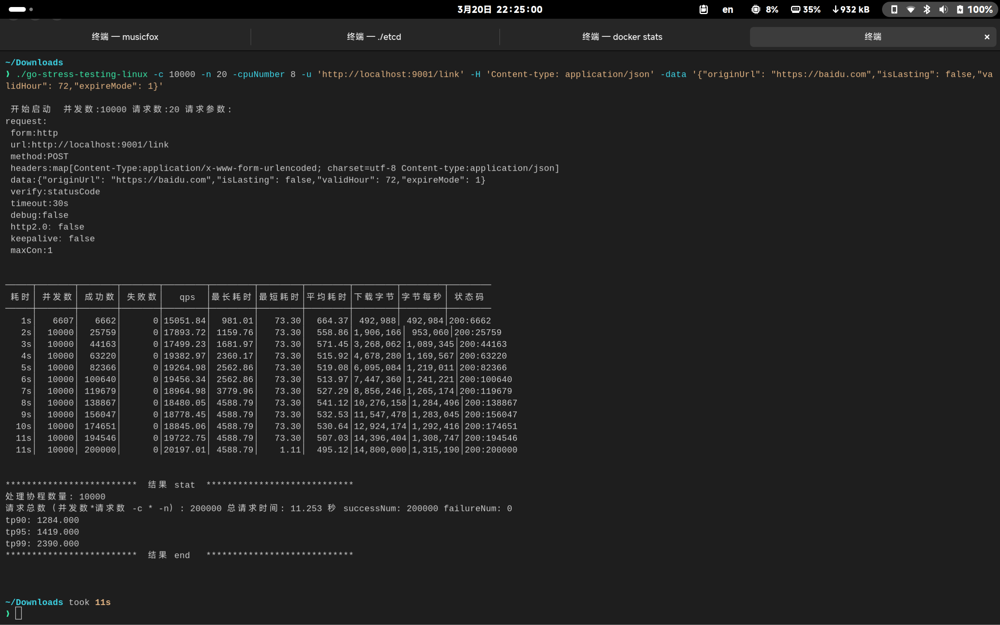

# Shortlink

`Shortlink` 是一个基于 `Go` 的分布式短链生成服务，提供了常用的短链生成、过期自动删除等功能，支持横向水平扩展，通过 `gRPC` 进行服务间通信，并对外暴露统一的 `HTTP` 接口。

主体架构分为**HTTP服务**和**核心服务**。其中，**HTTP服务**提供对外的`HTTP`接口，并通过 `RPC` 和特定的负载均衡算法与**核心服务**通信；**核心服务**负责现有的所有功能实现，启动后会向 `etcd` 注册当前节点。

## 功能特性

- [x] **短链生成**：通过修改后的 `snowflake` 算法生成唯一 `ID`，然后通过 `base62` 编码生成`11`位的唯一字符串作为短链。
- [x] **过期删除**：有两种删除模式，分别为精确删除和最终删除，精确删除使用 `redis` 的 `zset` 作为过期列表，使用过期时间的时间戳作为 `zset` 的 `score`，通过定时任务每分钟扫描一次进行删除；最终删除通过定时任务每12小时读取数据库记录进行删除。
- [x] **分布式部署**：所有服务均可水平扩展，使用了分布式锁确保数据一致性。
- [x] **负载均衡**：`HTTP`服务会监听 `etcd` 中核心服务的节点列表，通过特定的负载均衡策略（查询请求会使用一致性哈进行负载均衡，尽量保证相同的短链`key`可以请求同一节点，最大化利用核心服务的热`key`本地缓存；其余请求直接使用轮询策略）确保请求可以均匀覆盖。
- [x] **cuckoo过滤器**：过滤无效请求，避免无效短链在未命中缓存的情况下直接请求数据库
- [X] **分库分表存储**：数据库通过 `base62` 编码的特性分为 `62` 张表，使用短链的最后一位字符作为表名（例如 `T4IJtm2BNi4` 就会保存到`<prefix>_4`这张表），尽可能保证可以均匀存储。
- [x] **数据缓存**：使用 `redis` 作为分布式缓存，在缓存没有命中的请求下会加锁查询数据库，确保同一短链只有一个请求会真正查询数据库，如果数据库中也不存在那么会向`redis`中缓存一个短时间过期的空值。同时还使用滑动时间窗口做本地的热`key`监控，当某个短链在短时间内被大量访问时会添加到节点的本地缓存中。
- [ ] **访问统计**
- [ ] **管理面板**

## 技术栈

- 数据库：`postgresql`
- 缓存：`redis`
- cuckoo过滤器：`redisbloom`
- 过期列表：`redis`
- 短链生成：`snowflake` + `base62`
- 消息队列：`kafka`
- 注册中心：`etcd`
- 分布式锁：`redis`
- 服务通信：`gRPC`
- HTTP服务：`fasthttp`
- 部署：`Docker`

## 项目结构

```text
shortlink/
|-- library/             # 依赖部署和配置
|-- protos/              # proto文件
|-- server/              # http服务
|   |-- balance/         # 核心服务节点负载均衡
|   |-- cmd/             # 启动目录
|   |-- config/          # 服务配置
|   |-- interceptor/     # gRPC拦截器
|   |-- pb/              # protobuf和grpc代码
|-- shortlink/           # 核心服务
|   |-- cmd/             # 启动目录
|   |-- config/          # 服务配置
|   |-- data/            # 数据库连接
|   |-- pb/              # protobuf和grpc代码
|   |-- pkg/             # 共用工具包
|   |-- singleflight/    # 查询缓存
|   |-- snowflake/       # id生成
|-- sql
```

## 快速开始

### 依赖部署

`clone` 当前项目，需要 `go` 版本 >= 1.24

```shell
git clone https://github.com/wnnce/shortlink

cd shortlink
```

复制 [library](./library) 目录下的 `redis` 主从集群配置文件和 [docker-compose.yaml](./library/docker-compose.yaml)，在目标目录中执行以下命令启动所有依赖的容器。

```shell
# 启动所有容器
docker-compose up -d

# 查看容器是否成功启动
docker ps -a
```

如果使用了提供了 `redis` 配置文件，那么 `redis` 的容器在启动成功后，会自动进行主从同步，但是 `postgrsql` 的主从复制需要**手动配置**。

除了 `redis`、`postgresql`、`kafka` 之外，还依赖 `etcd` 注册中心，需要从[官网](https://etcd.io/)下载并启动。

### 编译

在核心服务和HTTP服务的目录中都提供了 `Dcokerfile` 文件，当需要使用 `docker` 部署时，可以使用通过 `docker build` 命令自动编译项目并打包为 `docker` 镜像，不需要 `docker` 部署直接使用 `go build` 编译即可。

```shell
# docker 部署
# 编译核心服务并打包为docker镜像
docker build -t shortlink:latest ./shortlink
# 编译HTTP服务并打包
docker build -t shortlink-api:latest ./server
# 编译完成后查看镜像
docker images

# 不使用docker部署
# 编译核心服务
cd shortlink
go build -o shortlink cmd/main.go
# 编译HTTP服务
cd server
go build -o shortlink-api cmd/main.go
```

### 修改配置

在服务的 `config` 目录中，修改其所依赖的配置信息，如果需要同时启动多个服务，那么**需要多个配置文件**。

```yaml
server: # 服务配置
  service-name: 'shortlink' # 服务名称
  area-id: 1 # 地域Id
  node-id: 1 # 节点Id
  host: '127.0.0.1' # 监听地址
  port: 8081 # 监听端口

etcd: # etcd配置
  endpoints: # etcd服务地址
    - '127.0.0.1:2379'
  dail-timeout: '3s' # 请求etcd超时时间
  dail-keep-alive-timeout: '3s' # 续期请求超时时间
  ttl: 30 # 保活时间

kafka: # kafka配置
  brokers: # kafka服务地址
    - '127.0.0.1:9092'
  add-topic: 'short-link-add' # 添加短链的topic
  delete-topic: 'short-link-delete' # 删除短链的topic
  add-group-id: 'short-link-add-group' # 添加短链的消费者group
  delete-group-id: 'short-link-delete-group' # 删除短链的消费值group

data: 
  redis: # redis配置
    master: # 主库配置
      host: '127.0.0.1'
      port: 7001
      username: 'default'
      password: 'admin'
      index: 0
    replicas: # 从库配置
      - #...
  database: # 数据库配置
    master: # 主库配置
      host: '127.0.0.1'
      port: 8001
      username: 'postgres'
      password: 'admin'
      db-name: 'shortlink'
    replicas: # 从库配置
      - # ...

```

### 服务部署

#### docker部署
使用 `docker` 部署服务时，需要提前打包好镜像，使用服务目录内提供的 `docker-compose.yaml` 文件直接运行即可，只需要关注其**服务的配置文件映射**。

```shell
cd shortlink
# 使用docker启动核心服务
docker-compose up -d

cd server
# 使用docker启动HTTP服务
docker-compose up -d
```
#### 手动部署
手动部署需要编译为二进制文件并运行，并在启动时指定服务的配置文件路径

```shell
cd shortlink
# 启动核心服务
./shortlink --config ./config/config-dev.yaml

# 启动HTTP服务
cd server
./shortlink-api --config ./config/config-dev.yaml
```

### 使用
#### 创建短链
创建短链的请求参数体
```json
{
  "originUrl": "https://baidu.com", // 短链对应的原始地址
  "isLasting": false, // 是否长期有效
  "validHour": 72, // 有效时间（单位：小时），长期有效模式下可以为空
  "expireMode": 1 // 过期删除模式 0:最终删除 1:精确删除，长期有效模式下可以为空
}
```
```shell
curl -X POST -H 'Content-type: application/json' -d '{"originUrl": "https://baidu.com","isLasting": false,"validHour": 72,"expireMode": 1}' http://localhost:9001/link
```
请求成功的返回参数
```json
{
  "code":200,
  "message":"ok",
  "data":"UfbIcbfFGSk", // 生成的短链地址
  "timestamp":1742540429391
}
```
#### 短链跳转
```shell
curl http://localhost:9001/<shortlink_key>
```
请求成功且短链存在会直接301跳转到短链对应的源网址
#### 查询短链详情
```shell
curl http://localhost:9001/info/<shortlink_key>
```
返回参数
```json
{
  "code": 200,
  "message": "ok",
  "data": {
    "id": 7708,
    "uniqueId": "14833660732033482752",
    "baseValue": "RpwUDnaCl1m",
    "originUrl": "https://baidu.com",
    "validHour": 72,
    "isLasting": false,
    "createTime": "2025-03-21 06:59:13",
    "expireTime": 1742799553527,
    "expireMode": 1,
    "clientIp": "127.0.0.1",
    "userAgent": "",
    "status": 0
  },
  "timestamp": 1742542878611
}
```
#### 删除短链
```shell
curl -X DELETE http://locahost:9001/<shortlink_key>
```
## Benchmark
在我 `6800H` 的笔记本上，所有服务和依赖都使用 `docker` 部署，启动单个HTTP服务和5个核心服务，其 `QPS` 可以达到 `2w` 左右。

